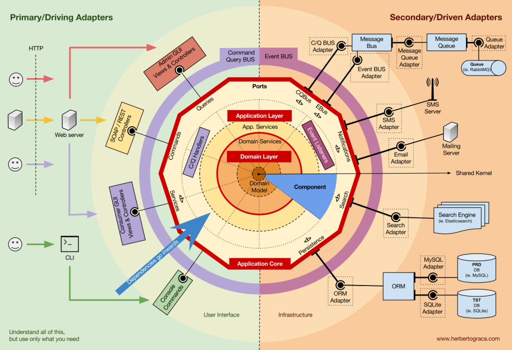

# 构建 Go Restful API 工程

## 架构图


## 目录结构
```
api
    |-- middleware
    |-- v1
        |-- 业务1
            - route.go
            - 业务1.go
        |-- 业务2 
            - route.go
            - 业务2.go    
        - router_v1.go
    - api.go
app
    - app.go
cert
conf
    - conf.go
docs
lib
    |-- log
    |-- utils
model
    |-- dto
    |-- entity
    - mysql.go    
repo
service
    - service.go
```

## 目录结构解析
- `api` 程序 restful 路由
  - `middleware` 路由中间件存放位置
  - `v1` 业务路由版本位置
    - `reouter_v1.go` 所有 v1 业务路由汇总地方
    - `业务1` v1 业务入口逻辑
  - `api.go` 路由核心文件，加载各业务版本及中间件
- `app` 整个程序的核心入口
- `conf` 整个程序的配置文件入口
- `model` 数据库实体以及接口入参以及返回参实体
    - `dto` 接口入参以及返回参
    - `entity` 数据库实体
- `lib` 项目的一些公共库
- `cert` 存放项目的证书文件
- `repo` 操作数据库相关的地方
- `service` 业务逻辑存放的地方
